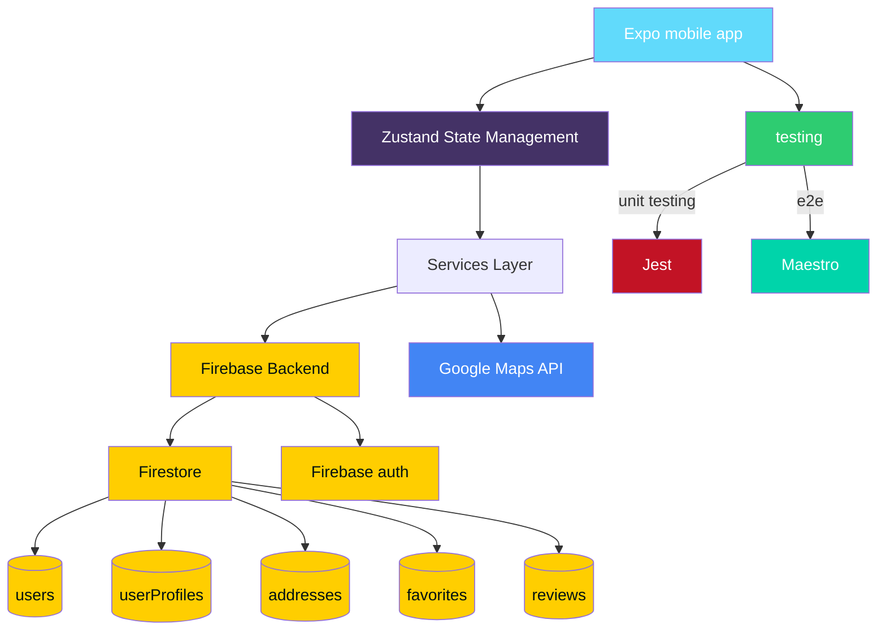

<div align="center">

  <h1>5mobd - Address Sharing App</h1>
  <p>
    <b>A React Native app for sharing and discovering addresses with reviews, built with Expo and Firebase.</b><br/>
  </p>
  
  <p>
    <a href="https://nodejs.org/"></a>
    <a href="https://reactnative.dev/"></a>
    <a href="https://expo.dev/"></a>
    <a href="https://firebase.google.com/"></a>
    <a href="https://zustand-demo.pmnd.rs/"></a>
    <a href="https://www.typescriptlang.org/"></a>
  </p>
</div>

## 🏗️ Architecture Overview



### Firestore Collections

| Collection     | Description                                            |
| -------------- | ------------------------------------------------------ |
| `users`        | User authentication data and basic profile information |
| `userProfiles` | Extended user profile data including profile photos    |
| `addresses`    | Address entries with location, photos, and metadata    |
| `favorites`    | User favorite addresses for quick access               |
| `reviews`      | User reviews with ratings and photos for addresses     |

## 📱 Download

<div align="center">
  <table>
    <tr>
      <th>Platform</th>
      <th>Download Link</th>
    </tr>
    <tr>
      <td>
        
      </td>
      <td>
        <a href="https://drive.google.com/file/d/1A_G5nvHnwtlruWBsq7XU4RjNSg11GUkT/view?usp=sharing">
          Download APK
        </a>
      </td>
    </tr>
    <tr>
      <td>
        
      </td>
      <td>
        <a href="https://drive.google.com/file/d/1NLelQ-63vm6YR3B2C01UYPETVbZocok6/view?usp=sharing">
          Download IPA
        </a>
      </td>
    </tr>
  </table>
</div>

## Features

| Feature                 | Description                                          |
| ----------------------- | ---------------------------------------------------- |
| **User Authentication** | Sign up, login, and profile management               |
| **Address Management**  | Create, view, and manage addresses                   |
| **Reviews System**      | Rate and review addresses with photos                |
| **Map Integration**     | View addresses on an interactive map                 |
| **Real-time Updates**   | Automatic data synchronization with 5-second polling |
| **Photo Support**       | Upload and view photos for addresses and profiles    |

## Quick Start

### 1. Install Dependencies

```bash
npm install
```

### 2. Firebase Setup

1. Create a Firebase project at [Firebase Console](https://console.firebase.google.com/)
2. Enable **Authentication** with Email/Password
3. Enable **Firestore Database**
4. Enable **Storage** for photo uploads
5. Copy your Firebase config to `firebaseConfig.ts`

### 3. Env variables setup

Setup your .env with the correct values from firebase

```sh
cp .env.example .env
```

### 4. Run the App

```bash
yarn
yarn start
```

Then scan the QR code with Expo Go app on your phone, or press `i` for iOS simulator / `a` for Android emulator.

## Development

- `yarn start` - Start Expo development server
- `yarn run android` - Run on Android
- `yarn run ios` - Run on iOS
- `yarn test` - Run tests
